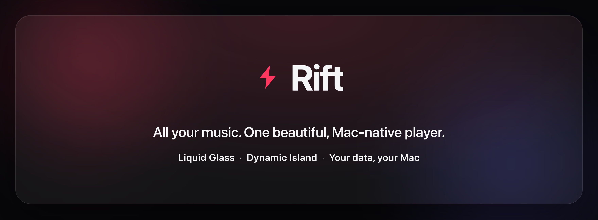
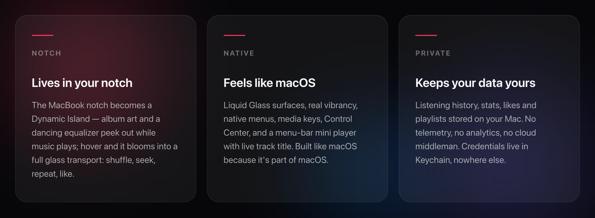
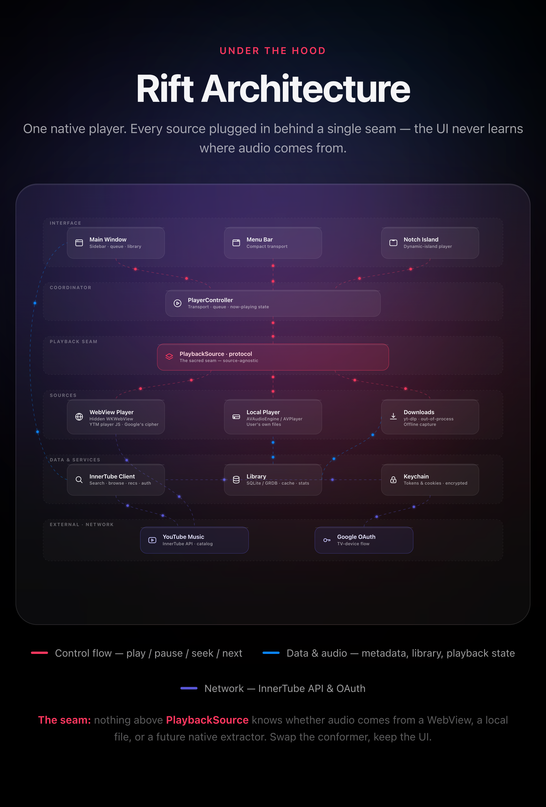
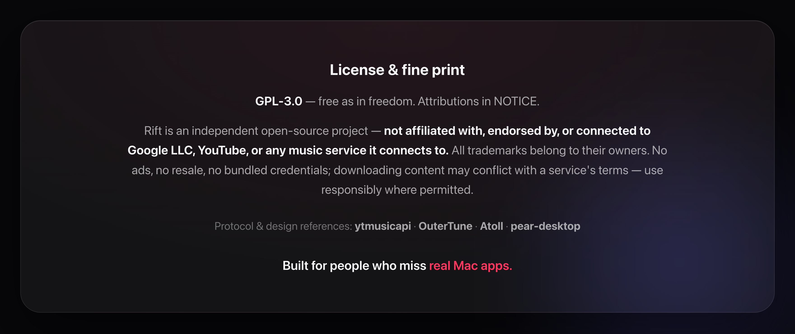

<div align="center">



<br><br>


**[Download](../../releases/latest)** · **[Roadmap](#roadmap)** · **[License](LICENSE)**

</div>

---

## The idea

**Rift is pure player.** Liquid Glass design, a Dynamic Island in your notch, and your data stays on your Mac — no cloud, no telemetry.

Connect your Google account to unlock YouTube Music's full library and recommendation engine. Everything flows into native SwiftUI: listen, download, build playlists, track your stats. The architecture goes further — each music service plugs in behind the same playback interface, so **one library, one player, many platforms** arrives without changing the UI.

---

## What Rift does



| | |
|---|---|
| **Full catalog, native UI** | Search, albums, artists, playlists, moods, charts — all rendered in SwiftUI |
| **Real recommendations** | Home feed, radio & autoplay, *"More like…"* and *"Because you liked…"* shelves seeded by what you actually play |
| **Likes & playlists that sync** | Local-first and instant; signed in, they push back to your account |
| **Offline** | Download tracks and keep them; streamed audio caches for instant replay |
| **Lyrics + on-device AI** | Built-in lyrics; optional local AI (Apple Intelligence or Ollama) transliterates and translates them |
| **Your listening, charted** | Top songs, top artists, listening clocks by hour and weekday — computed locally |
| **A player that behaves** | Resume where you left off, near-gapless preloading, global shortcuts, anonymous mode without any account |

---

## Get Rift

> **In active development** — expect rough edges while we head to 1.0.

**Download** — grab the latest `.dmg` from [Releases](../../releases/latest), drag to Applications, done.

**From source:**

```bash
git clone <url>
open Rift.xcodeproj   # Xcode 26+ · macOS 26 Tahoe
```

A notch Mac is needed for the Dynamic Island; everything else works on any Mac running Tahoe. Streaming uses `yt-dlp` under the hood — Homebrew if available, Python 3.10+ fallback, or a standalone binary otherwise.

---

## Under the hood



> **The core rule:** nothing above `PlaybackSource` knows where audio comes from. That seam turns "a YouTube Music client" into "a player for everything" — each new service is a new conformer, and the same UI never changes.

*[View the interactive diagram →](Docs/architecture.html)* (open in a browser)

---

## Roadmap

- [x] Native browse: search, artists, albums, charts, moods
- [x] Notch Dynamic Island + menu-bar player
- [x] Likes, playlists, downloads, stats, lyrics + local AI
- [ ] Gapless playback & crossfade
- [ ] Local file library (your own MP3 / FLAC)
- [ ] Vinyl mode — spinning record, tonearm and all
- [ ] Signed & notarized releases, auto-update
- [ ] **More services behind the same player** — the unified library

---

<div align="center">



</div>

**[GPL-3.0](LICENSE)** — free as in freedom. Attributions in [NOTICE](NOTICE).

Rift is an independent open-source project — **not affiliated with, endorsed by, or connected to Google LLC, YouTube, or any music service it connects to.** All trademarks belong to their owners. No ads, no resale, no bundled credentials; downloading content may conflict with a service's terms — use responsibly where permitted.

Protocol & design references: [ytmusicapi](https://github.com/sigma67/ytmusicapi) · [OuterTune](https://github.com/OuterTune/OuterTune) · [Atoll](https://github.com/Ebullioscopic/Atoll) · [pear-desktop](https://github.com/pear-devs/pear-desktop)
